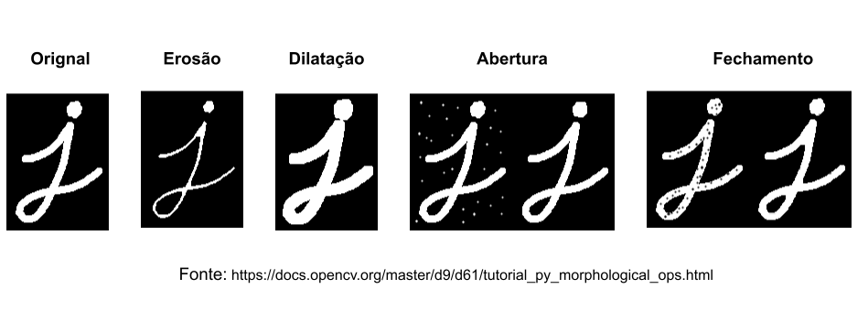
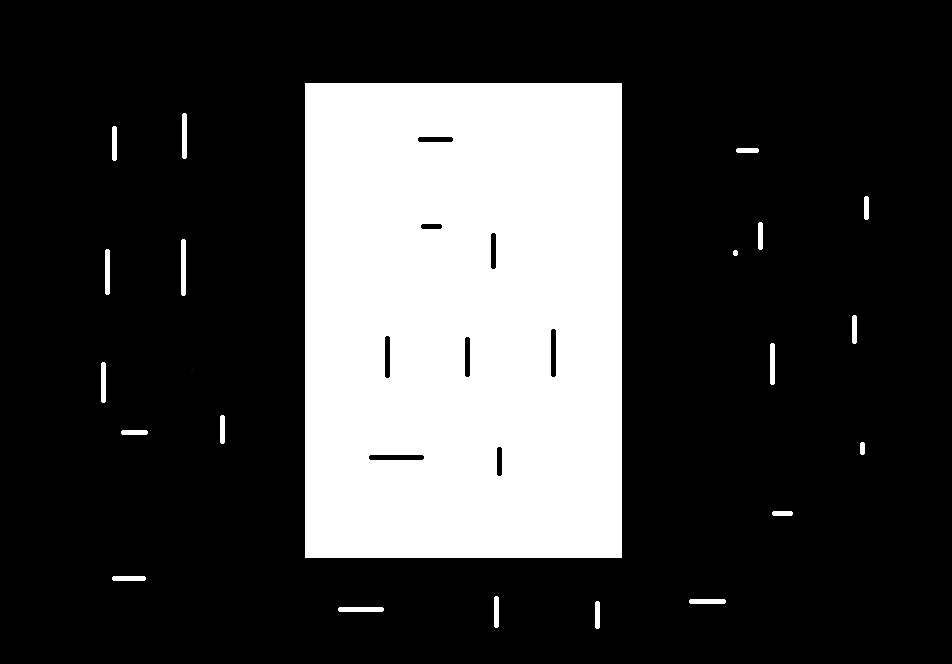
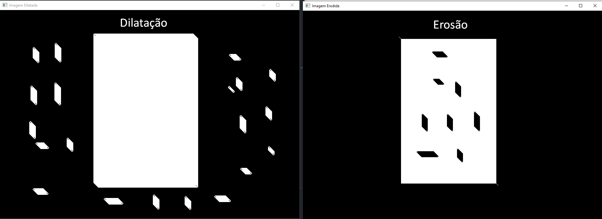
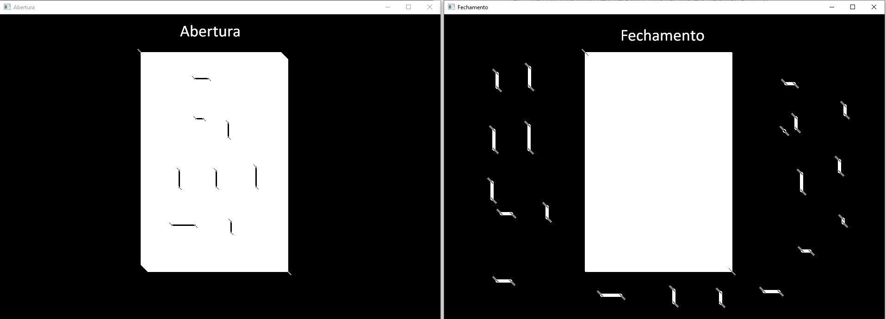

# Processamento de Imagens :computer: 

## Operações Morfológicas

<p align="center">
    
</p>


#### Este é um projeto da Disciplina Processamento de Imagens do curso de *Ciência da Computação* - *Campus. Arapiraca*.
* Professor:
    Tácito Trindade de Araújo Tiburtino Neves
* Aluno:
    Júlio Miguel de Souza Costa

### Descrição geral do projeto

Este projeto contém algorítmos que visa realizar as tradicionais operações morfológicas nas imagens tais como: *Erosão*, *Dilatação*, *Abertura* e *Fechamento*.

### Requisitos

> implementar código que permita a escolha de um
    elemento estruturante e receba uma imagem de entrada. A saída do
    algoritmo será o resultado da aplicação do elemento estruturante para
    as operações de morfologia: dilatação, erosão, abertura e fechamento.

### Fundamentação

#### :warning: Observação: toda implementação está nos respectivos arquivos

Para que seja possível realizar as operações morfológicas nessa implementação é necessário ter uma imagem preto e branco (binarizá-la) e obter o contorno dessa imagem de entrada.
Para isso, no arquivo de entrada ([main.py](main.py)) realiza-se estes pré-requisitos para garantir a execução correta dos algorítmos.

```python
"""
Imports omitidos
"""

imagem_original = cv.cvtColor(io.imread(caminho_imagens + "img01.png"), cv.COLOR_RGBA2GRAY)
imagem_binaria = binarizar(imagem_original)

img_contornada = gerar_imagem_contornada(imagem_binaria)

```
#### Elemento Estruturante

A escolha do *elemento estruturante* se dá pela ferramenta do open-cv e é possível definir as dimensões do mesmo na tupla para que a depender da imagem obtenha-se um melhor resultado.

```python
elemento_estruturante = cv.getStructuringElement(cv.MORPH_ELLIPSE, (15,15))
```
#### Algorítmos de transformações morfológicas: visão geral

```python
import numpy as np
from utils import gerar_imagem_contornada, imagem_preto_branco

def dilatar(imagem, elemento_estruturante, contornos_img):

        img_a_dilitar = imagem_preto_branco(imagem) 

        c = int(len(elemento_estruturante)/2) 

        for i in range(len(img_a_dilitar)):
            for j in range(len(img_a_dilitar[0])):

                if contornos_img[i, j] == 255:

                    for k in range(len(elemento_estruturante)):
                        for l in range(len(elemento_estruturante[0])):

                            if elemento_estruturante[k, l] != 0:

                                try:
                                    img_a_dilitar[i + k - c, j + k - c] = 255
                                except:
                                    pass

        return img_a_dilitar  

def erodir(imagem, elemento_estruturante, contornos_img):
    """
    Implementação segue a forma do algorítmo de dilatar com a diferença do trecho
    img_a_erodir[i + k - c, j + k - c] = 0 que é setado o inverso (pixels pretos)
    """

def abertura(imagem, elemento_estruturante, contornos_img):
        img_copia = np.copy(imagem)
        img_erodida = erodir(img_copia, elemento_estruturante, contornos_img)
        contorno_novo = gerar_imagem_contornada(img_erodida)
        img_abertura = dilatar(img_erodida, elemento_estruturante, contorno_novo)

        return img_abertura

def fechamento(imagem, elemento_estruturante, contornos_img):
        img_copia = np.copy(imagem)
        img_dilatada = dilatar(img_copia, elemento_estruturante, contornos_img)
        contorno_novo = gerar_imagem_contornada(img_dilatada)
        img_fechamento = erodir(img_dilatada, elemento_estruturante, contorno_novo)

        return img_fechamento

```
#### Algorítmos de transformações morfológicas: estratégia dos contornos da imagem

A obtenção das bordas da imagem servem para que ao invés de percorrer toda ela eu passe o *elemento estruturante* onde realmente interessa (as bordas) - pintando-as de branco ou preto para realizar dilatação ou erosão.
No arquivo ([utils.py](utils.py)) há a função que gera os contornos da imagem. Esta função foi desenvolvida utilizando a biblioteca skimage.

#### Algorítmos de transformações morfológicas: como funciona

```python
# ...

# Percorre a imagem
for i in range(len(img_a_dilitar)):
    for j in range(len(img_a_dilitar[0])):

        # Se for uma borda, aplica-se logo mais o elemento estruturante com o pixel branco (255)
        if contornos_img[i, j] == 255:

            # Percorre o elemento estruturante
            for k in range(len(elemento_estruturante)):
                for l in range(len(elemento_estruturante[0])):

                    # Confere se o elemento estruturante está contido na matriz
                    if elemento_estruturante[k, l] != 0: 

                        try:
                            # Aplicando a transformação - neste caso pintando de branco (dilatando). 
                            # Obs: O c é uma espécie de correção para não aplicar o elemento estruturante errado
                            img_a_dilitar[i + k - c, j + k - c] = 255
                        except:
                            pass

# ...

```

### Resultados

<h3 align="center"> Imagem Original </h3>

<p align="center">
    
</p>

<h3 align="center"> Erosão e Dilatação </h3>

<p align="center">
    
</p>


<h3 align="center"> Abertura e Fechamento </h3>

<p align="center">
    
</p>


### Setup do projeto e inicialização
* Ambiente Windows 10
* Python 3.9.5

Com o python instalado, precisaremos instalar alguns pacotes para o projeto funcionar:

```console
pip install opencv-python
```
```console
pip install numpy
```
```console
pip install pip install -U scikit-image
```

Após instalado os pacotes acima, dentro do diretório do projeto, execute o comando abaixo para inicializar o projeto:

#### :warning: A execução dos algorítmos podem demorar, então aguarde exibir as telas com as imagens processadas


```console
python .\main.py
```

